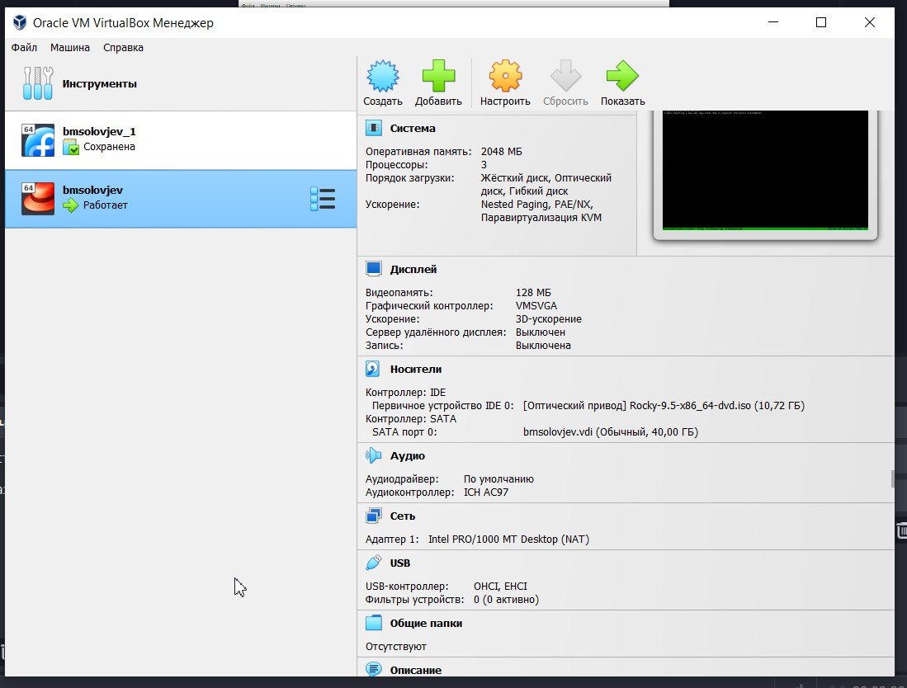
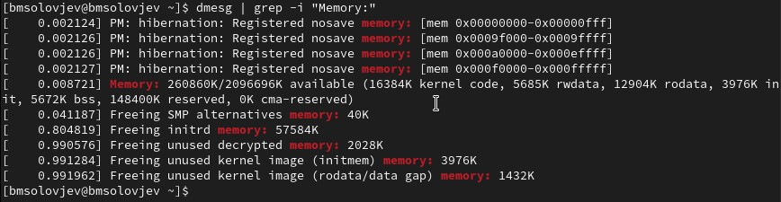

# Отчёт по лабораторной работе N1
## Основы информационной безопасноти
## Соловьев Богдан НКАбд-04-23

---
# Задание

1. Установка на виртуальную машину и настройка операционной системы.
2. Найти информацию о системе.

---
# Выполнение лабораторной работы

Я установил образ операционной системы Linux Rocky 9. Открыл VirtualBox и нажал на кнопку создания новой виртуальной машины.

---


Чтобы работа на виртуальной машине была комфортной (и вообще чтобы она хотя бы запустилась), указываю количество выделенной операционной памяти 2046 (значение посмотрел в интернете), а также количество процессоров 3.

---



С первого раза не получилось запустить из-за неправильных настроек. Указав всё так, как показано на скриншоте, мне, наконец, удалось запусутить виртуальную машину.

---


Никаких ошибок не было. Большинство настроек изначально были корректны. Убрал только KDUMP, указал название и пароль для учётной записи и выбрал диск.

---


```
Операционная система запустилась и работает без зависаний (возможно пока что)
```

---

# Дополнительное задание


```
dmesg | grep -i "Linux version"
```
Узнаём версию ядра указана полсе Linux version 


---


```
dmesg | grep -i "Detected"
```
Узнаём частоту процессора
2096 Mhz

---


```
dmesg | grep -i "CPU0"
```
Узнаём модель процессора
AMD Ryzen 5 5500U

---


```
dmesg | grep -i "Memory:"
```
Узнаём Объем доступной оперативной памяти (Memory available).
260860K свободно

---


```
dmesg | grep -i "Hypervisor"
```
Тип обнаруженного гипервизора (Hypervisor detected).
KVM

---


---

# Выводы
Я научился устанавливать операционную систему на виртуальную машину.