# Отчёт по лабораторной работе N1
## Основы информационной безопасноти
## Соловьев Богдан НКАбд-04-23

---
# Содержание
1. Цель работы
2. Задание
3. Выполнение лабораторной работы
4. Выполнение дополнительного задания
5. Ответы на контрольные вопросы
6. Выводы

---
# Цель работы


Целью данной работы является приобретение практических навыков установки операционной системы на виртуальную машину, 
настройки минимально необходимых для дальнейшей работы 
сервисов.


---
# Задание

1. Установка на виртуальную машину и настройка операционной системы.
2. Найти информацию о системе.

---
# Выполнение лабораторной работы

Я установил образ операционной системы Linux Rocky 9. Открыл VirtualBox и нажал на кнопку создания новой виртуальной машины.

---

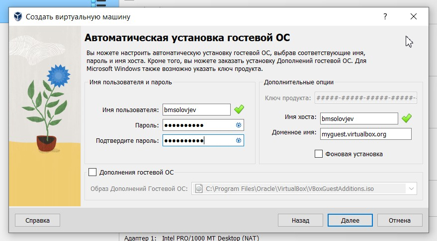

Указал имя пользователя и пароль для гостевой операционной системы

---

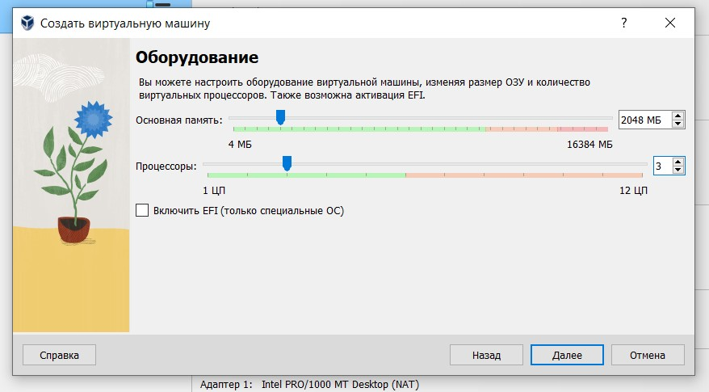
Чтобы работа на виртуальной машине была комфортной (и вообще чтобы она хотя бы запустилась), указываю количество выделенной операционной памяти 2046 (значение посмотрел в интернете), а также количество процессоров 3.

---

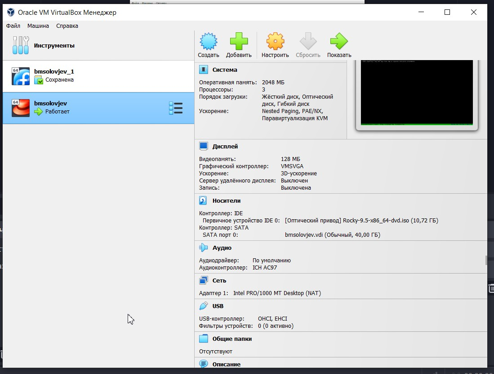

С первого раза не получилось запустить из-за неправильных настроек. Указав всё так, как показано на скриншоте, мне, наконец, удалось запусутить виртуальную машину.

---

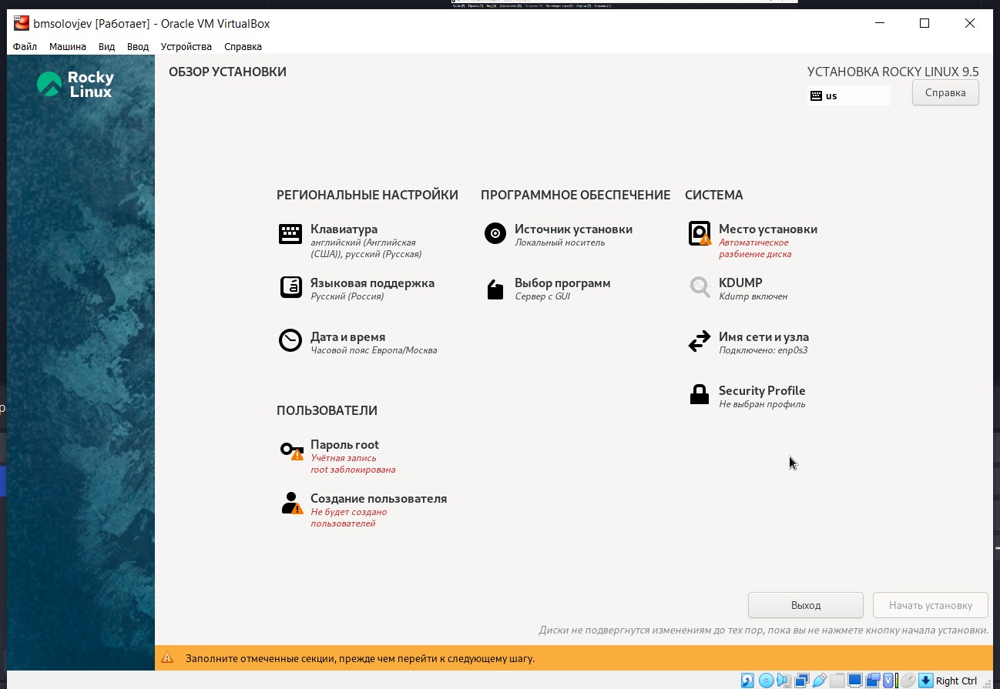
Далее я последовательно выполнил все настройки для установки системы

---

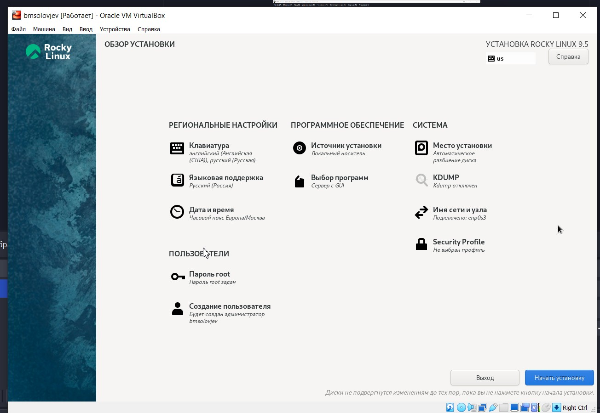
Никаких ошибок не было. Большинство настроек изначально были корректны. Убрал только KDUMP, указал название и пароль для учётной записи и выбрал диск.

---

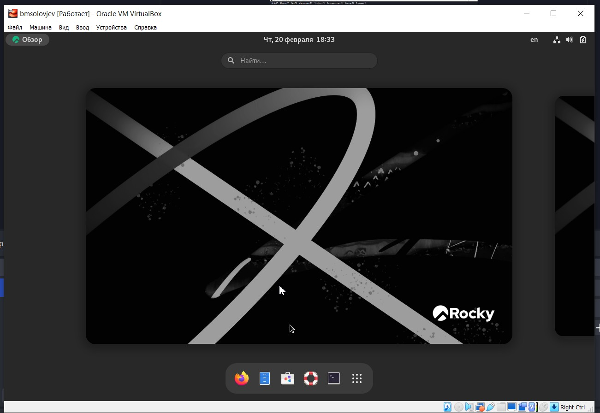

```
Операционная система запустилась и работает без зависаний (возможно пока что)
```

---

# Дополнительное задание
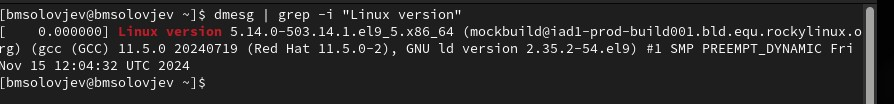

```
dmesg | grep -i "Linux version"
```
Узнаём версию ядра указана полсе Linux version 


---

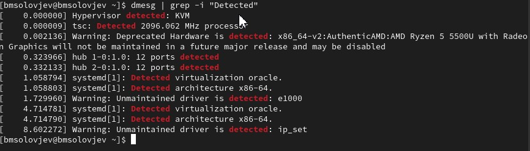
```
dmesg | grep -i "Detected"
```
Узнаём частоту процессора
2096 Mhz

---


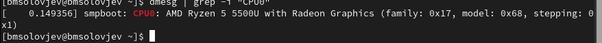
```
dmesg | grep -i "CPU0"
```
Узнаём модель процессора
AMD Ryzen 5 5500U

---

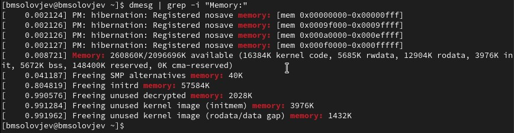
```
dmesg | grep -i "Memory:"
```
Узнаём Объем доступной оперативной памяти (Memory available).
260860K свободно

---

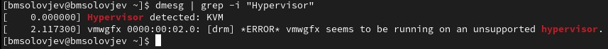
```
dmesg | grep -i "Hypervisor"
```
Тип обнаруженного гипервизора (Hypervisor detected).
KVM

---
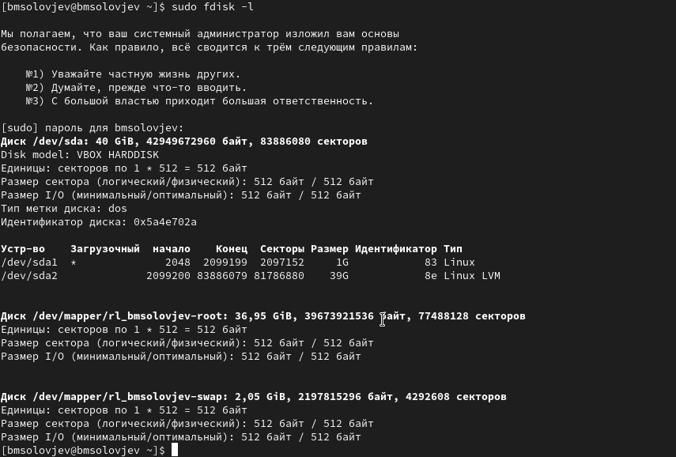

---

# Ответы на контрольные вопросы
1. Учётная запись пользователя
Имя пользователя, UID, GID, домашний каталог, оболочка, пароль, комментарий

---
2. Команды терминала
Справка: man <команда>, <команда> --help.
Перемещение: cd <путь>, cd .., cd ~.
Просмотр каталога: ls, ls -l, ls -a.
Объём каталога: du -sh <каталог>.
Создание/удаление:
Каталог: mkdir, rmdir.
Файл: touch, rm.
Права: chmod <права>, chown <пользователь>:<группа>.
История: history, !<номер>.

---

3. Файловая система
Способ организации данных на диске.
Примеры:
ext4: Linux, журналирование, надежность
NTFS: Windows, большие файлы, права доступа.
FAT32: Совместимость, ограничение 4 ГБ.
XFS: Высокая производительность, серверы.

4. Подмонтированные файловые системы
mount: Список смонтированных ФС.
df -h: Информация с размерами

---

5. Удаление зависшего процесса
Найти PID: ps aux | grep <имя>.
Завершить: kill <PID>, kill -9 <PID>.
По имени: pkill <имя>

---
# Выводы
Я научился устанавливать операционную систему на виртуальную машину.